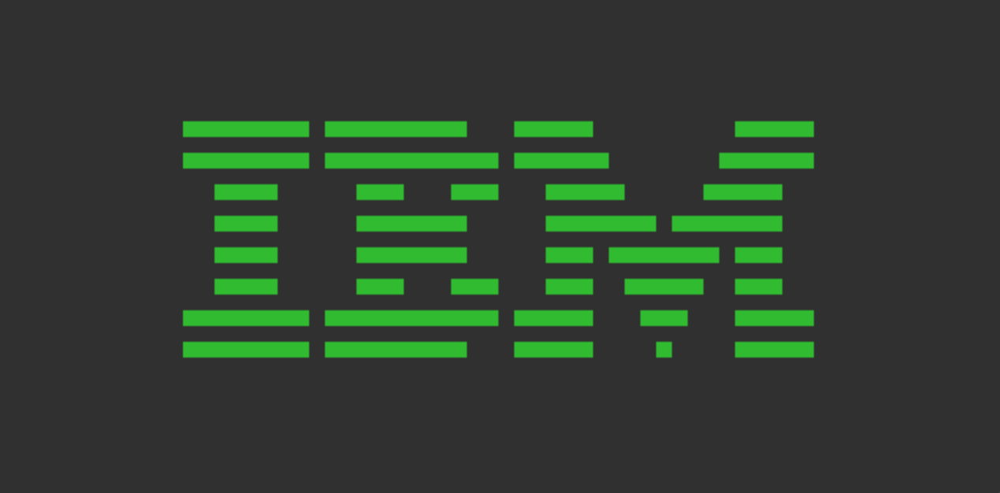

> Kill the C version, and let the Zig version be born

-- Aemon Targaryen (probably)

# chip8z

A CHIP-8 emulator, written in Zig, as a direct port from [my C version](https://github.com/ltriant/chip8).

I'm also using this as a place to try out Zig-isms.

# Building

[SDL2](https://libsdl.org/) is required for the graphics, and it can be installed via many different package managers:

```
$ brew install sdl2
$ sudo apt-get install libsdl2-dev
$ sudo yum install SDL2-devel
```

Or see the [libsdl installation documentation](https://wiki.libsdl.org/Installation) for more options.

After that, it can be built with the Zig toolchain, which can be installed via most package managers:

```
$ brew install zig --HEAD
...
$ zig build
...
```

# Running

ROMs can be sourced from anywhere you like, however I recommend getting them from [dmatlack/chip8](https://github.com/dmatlack/chip8/tree/master/roms/games). ROMs can be invoked with the path to the ROM as the argument:

```
$ zig-out/bin/chip8z roms/pong.ch8
```

# Keyboard

The original CHIP-8 keypad is on the left, and what I've mapped it to on a QWERTY keyboard is on the right:

```
Keypad                   Keyboard
+-+-+-+-+                +-+-+-+-+
|1|2|3|C|                |1|2|3|4|
+-+-+-+-+                +-+-+-+-+
|4|5|6|D|                |Q|W|E|R|
+-+-+-+-+       =>       +-+-+-+-+
|7|8|9|E|                |A|S|D|F|
+-+-+-+-+                +-+-+-+-+
|A|0|B|F|                |Z|X|C|V|
+-+-+-+-+                +-+-+-+-+
```

# Issues

There are various quirks, which probably won't be fixed.
